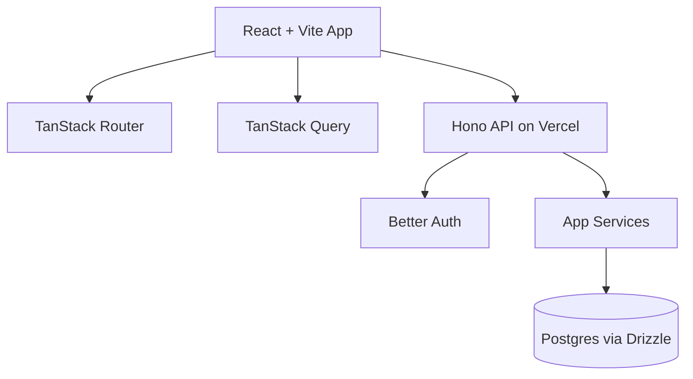

# Recipe App Plan

## Status

This document defines the agreed architecture, scope, sequencing, and delivery plan before implementation begins.

## Product Summary

Build a shared recipe and shopping list app with these core behaviors:

- Users sign in with Google OAuth.
- Multiple accounts can access the same shared household data.
- A household has one active shopping list in MVP.
- Recipes are saved permanently.
- Recipes may be name-only or include item rows.
- Items are permanent reusable catalog entries.
- Quantities belong only to recipe rows and shopping list rows, not to the item itself.
- Typing an item in recipes or shopping list should autocomplete existing saved items.
- If a typed item does not already exist, creating that row should also create the item in the item catalog.
- Shopping list rows can be checked off.
- Checked shopping list rows remain visible until explicitly cleared.
- The shopping list supports a bulk `Delete checked items` action.
- Permanent items support archive/restore instead of routine hard delete.
- The app is mobile-first and must still work well on desktop.

## Non-Functional Constraints

- Main cost goal: avoid paying for services or hosting.
- Backend and auth should remain owned by the app, not tied to an expensive managed platform.
- The architecture should stay simple enough for a small personal/shared household app.
- The stack should preserve future freedom to migrate infrastructure if needed.

## Agreed Stack

### Frontend

- React
- Vite
- TypeScript
- TanStack Router
- TanStack Query
- shadcn/ui
- Custom theme to be applied before UI implementation begins
- shadcn preset: `b1226dcyno`

### Backend

- Hono
- Better Auth with Google OAuth
- Drizzle ORM
- PostgreSQL

### Hosting

- Vercel Hobby for frontend and API deployment
- Free Postgres host, expected target: Neon Free

## High-Level Architecture



### Architectural Notes

- The frontend should not talk directly to the database.
- All protected data access should go through Hono API handlers.
- Authentication is handled by Better Auth.
- Authorization is enforced in backend application code using household membership checks.
- Server-side business logic should live in service modules, not in route handlers or React components.

## Domain Model

### Core Concepts

- `household`: shared ownership boundary for the app's data
- `item`: permanent reusable catalog entry such as `tomato` or `pasta`
- `recipe`: saved recipe template
- `recipe_item`: quantity-bearing item row attached to a recipe
- `shopping_list_item`: quantity-bearing, checkable row on the active household shopping list
- `category`: primary item grouping for shopping list organization
- `tag`: optional secondary metadata for items

### Important Modeling Rules

- Items do not store quantity.
- Recipe quantities live on `recipe_items`.
- Shopping list quantities live on `shopping_list_items`.
- `shopping_list_item.id` is the primary row identity in the UI, not just `item_id`.
- One active shopping list per household is enough for MVP.
- Permanent items should be archived/restored, not routinely hard-deleted.
- `Delete checked items` removes checked shopping list rows only. It must not delete permanent items.

## Suggested Database Schema

### Auth and User Tables

Better Auth will require its own auth/session-related tables according to its integration pattern.

Additional app-level tables:

#### `users`

- app-level user record if needed beyond Better Auth tables

#### `households`

- `id`
- `name`
- `created_at`
- `updated_at`

#### `household_members`

- `id`
- `household_id`
- `user_id`
- `role`
- `created_at`

#### `invite_codes`

- `id`
- `household_id`
- `code`
- `created_by_user_id`
- `expires_at` nullable
- `used_at` nullable depending on final invite policy
- `created_at`

### Item Catalog

#### `item_categories`

- `id`
- `household_id`
- `name`
- `sort_order`
- `created_at`
- `updated_at`

#### `items`

- `id`
- `household_id`
- `name`
- `normalized_name`
- `category_id` nullable
- `archived_at` nullable
- `created_by_user_id`
- `created_at`
- `updated_at`

Constraint:

- unique `(household_id, normalized_name)`

#### `item_tags`

- `id`
- `item_id`
- `tag`

Constraint:

- unique `(item_id, tag)`

### Recipes

#### `recipes`

- `id`
- `household_id`
- `name`
- `notes` nullable
- `created_by_user_id`
- `created_at`
- `updated_at`
- `archived_at` nullable only if recipe archive is later desired

#### `recipe_items`

- `id`
- `recipe_id`
- `item_id`
- `quantity`
- `sort_order`
- `created_at`
- `updated_at`

Constraint:

- likely unique `(recipe_id, item_id)` in MVP

### Shopping List

#### `shopping_list_items`

- `id`
- `household_id`
- `item_id`
- `quantity`
- `checked`
- `checked_at` nullable
- `created_at`
- `updated_at`

Constraint:

- unique `(household_id, item_id)` if the active list should merge duplicate additions into one row

## Business Rules

### Households

- A user belongs to one household in MVP.
- A household can have multiple members.
- Shared data is always scoped to the household.

### Items

- Items are permanent catalog entries.
- Items are created from the dedicated items view or inline from recipe/shopping list entry.
- Inline item creation should only happen on explicit submit or selection, not on every keystroke.
- Archived items should be hidden from normal browsing and autocomplete.
- If an archived item becomes actively used again, prefer auto-unarchive on reuse.

### Recipes

- A recipe can exist with name only and zero recipe rows.
- Recipe item quantities are integers in MVP.
- A recipe references saved catalog items rather than storing its own free-text ingredient labels.

### Shopping List

- There is one active household shopping list in MVP.
- Adding an item manually creates or updates a `shopping_list_item` row.
- Adding a recipe to the shopping list should upsert rows by `item_id`.
- If a row already exists, quantity increases.
- If the row is checked and is added again, it should become unchecked and its `checked_at` cleared.
- Checked rows remain visible until explicitly cleared.
- `Delete checked items` removes checked shopping list rows for the current household.

## Autocomplete and Item Creation Flow

### Expected UX

- Typing in a recipe item input or shopping list input should search existing household items.
- Prefix matches like `to` should suggest `tomato`.
- If no exact item exists, the UI should allow creating a new item with the entered label.

### Backend Behavior

- Search should use household scope.
- Search should exclude archived items by default.
- Item normalization should likely be lowercase + trimmed whitespace.
- Item creation from free text must enforce the unique normalized-name constraint.

## API Plan

### Auth

- Better Auth routes mounted under `/api/auth/*`
- Session-aware `GET /api/me`

### Household

- `GET /api/household`
- `POST /api/household/create`
- `POST /api/household/join`
- `POST /api/invite-codes`
- `GET /api/invite-codes`

### Categories

- `GET /api/categories`
- `POST /api/categories`
- `PATCH /api/categories/:id`
- `DELETE /api/categories/:id` if safe

### Items

- `GET /api/items`
- `GET /api/items/search`
- `POST /api/items`
- `PATCH /api/items/:id`
- `POST /api/items/:id/archive`
- `POST /api/items/:id/restore`
- `POST /api/items/:id/tags`
- `DELETE /api/items/:id/tags/:tag`

### Recipes

- `GET /api/recipes`
- `GET /api/recipes/:id`
- `POST /api/recipes`
- `PATCH /api/recipes/:id`
- `DELETE /api/recipes/:id` or archive later if desired
- `POST /api/recipes/:id/add-to-shopping-list`

### Shopping List

- `GET /api/shopping-list`
- `POST /api/shopping-list/items`
- `PATCH /api/shopping-list/items/:shoppingListItemId`
- `POST /api/shopping-list/items/:shoppingListItemId/toggle-checked`
- `POST /api/shopping-list/delete-checked`
- `DELETE /api/shopping-list/items/:shoppingListItemId`

## Backend Service Layer

Recommended service functions:

- `getCurrentHouseholdForUser`
- `assertHouseholdMembership`
- `normalizeItemName`
- `findOrCreateItem`
- `archiveItem`
- `restoreItem`
- `searchItems`
- `createRecipe`
- `updateRecipe`
- `addRecipeToShoppingList`
- `addItemToShoppingList`
- `toggleShoppingListItemChecked`
- `deleteCheckedShoppingListItems`
- `joinHouseholdByInviteCode`

These should contain domain behavior. Route handlers should stay thin.

## Frontend Plan

### Primary Screens

- Login
- Recipes list
- Recipe editor/detail
- Shopping list
- Items
- Settings

### Mobile-First UX

- Bottom navigation on mobile for primary sections
- Comfortable tap targets for list rows and checkboxes
- Streamlined add-item and add-recipe flows

### Desktop UX

- Sidebar or top-nav layout
- Wider content columns with preserved mobile-friendly interaction density

### Planned UI Component Areas

- Auth screens
- App shell / nav
- Item autocomplete combobox
- Recipe list and cards
- Recipe item editor rows
- Shopping list grouped sections
- Items catalog table/list
- Category and tag editors
- Dialog for clearing checked items

### Theme Integration

- Use shadcn/ui components as the base component system.
- Apply the provided custom theme before final UI styling work begins.
- Preserve the agreed mobile-first layout while adapting the theme.

## Project Structure Recommendation

One repo, likely structured like this:

```text
recipe-app/
  api/
    src/
      auth/
      db/
      lib/
      middleware/
      routes/
      services/
      index.ts
  web/
    src/
      app/
      components/
      features/
      lib/
      routes/
      styles/
      main.tsx
  packages/
    db/
      src/
        schema/
        client.ts
        relations.ts
    shared/
      src/
        schemas/
        types/
  PLAN.md
```

This can be simplified if a flatter structure is preferred, but the separation between frontend, backend, and shared database code should remain clear.

## Authorization Strategy

Every protected backend route should:

1. require a valid Better Auth session
2. resolve the authenticated user
3. resolve the current household membership
4. scope all reads and writes to that household

This is the main security boundary now that the app is not relying on database RLS.

## Hosting and Deployment Plan

### Vercel Hobby

- Host the frontend build
- Host Hono API endpoints under `/api/*`
- Prefer Node runtime initially instead of Edge for easier auth/session behavior

### Database

- Use free Postgres hosting, expected target: Neon Free

### Environment Variables

Expected categories:

- Better Auth secrets
- Google OAuth client credentials
- database connection string
- application base URL

## Main Risks

### Technical Risks

- Authorization bugs if household scoping is missed on any backend route
- OAuth callback and cookie handling between local and production environments
- Free-tier limits on hosting/database providers
- Vercel serverless runtime quirks with auth/session libraries
- Duplicate item naming if normalization rules are weak

### Product Risks

- Category naming drift without lightweight management UX
- Archived items causing confusion if recipes still reference them
- Quantity model may later need units or partial completion, which are intentionally out of MVP

## Focused Verification Strategy

As implementation begins, verify in this order:

1. Auth flow works locally with Google login.
2. Session cookie survives refresh and protected route checks.
3. Household creation/join flow correctly scopes all data.
4. Item autocomplete only returns current-household items.
5. Inline item creation respects normalized uniqueness.
6. Recipe creation with and without recipe rows works.
7. Adding recipe to shopping list merges quantities by item.
8. Checking/unchecking list rows behaves correctly.
9. `Delete checked items` removes only checked shopping list rows.
10. Archived items are excluded from normal autocomplete but can still render in historical references.

## Implementation Sequence

### Phase 1: Project Setup

1. Scaffold monorepo structure.
2. Set up Vite frontend.
3. Set up Hono backend.
4. Set up TypeScript config and shared package boundaries.
5. Set up shadcn/ui foundation without final theme styling.

### Phase 2: Database and Auth

1. Configure Postgres and Drizzle.
2. Define auth-related tables as needed by Better Auth.
3. Define app tables.
4. Add migrations.
5. Integrate Better Auth with Google OAuth.
6. Add auth/session middleware.

### Phase 3: Household and Authorization

1. Create household model and membership checks.
2. Add invite code generation and join flow.
3. Add `GET /api/me` and current household resolution.

### Phase 4: Item Catalog

1. Build item categories.
2. Build item CRUD.
3. Build archive/restore.
4. Build tag CRUD.
5. Build item search/autocomplete.

### Phase 5: Shopping List

1. Build shopping list item CRUD.
2. Add checkbox toggle behavior.
3. Add `Delete checked items`.
4. Add category-grouped list presentation.

### Phase 6: Recipes

1. Build recipe CRUD.
2. Build recipe item rows and item autocomplete integration.
3. Add `add recipe to shopping list` flow.

### Phase 7: UI and Theme

1. Build app shell and routing.
2. Build mobile-first layouts.
3. Apply the provided custom shadcn theme.
4. Tune desktop layout.

### Phase 8: Hardening

1. Validate authorization coverage.
2. Verify archive behavior and inline creation edge cases.
3. Verify deployment and production OAuth config.

## MVP Acceptance Criteria

- A user can sign in with Google.
- A user can create or join a household.
- Household members see the same shared data.
- A user can create items, categories, and tags.
- A user can archive and restore items.
- Typing item names in recipes or shopping list suggests existing items.
- Creating a missing item inline saves it into the item catalog.
- A user can create recipes with zero or more quantity-bearing item rows.
- A user can add a recipe to the active shopping list.
- Shopping list rows use their own row identity in the UI.
- A user can check and uncheck shopping list rows.
- A user can bulk delete checked shopping list rows.
- Deleting checked shopping list rows does not delete the underlying item catalog entries.
- The UI works well on mobile and remains usable on desktop.

## Deferred for Later

- Multiple named shopping lists
- Shopping list history or trip history
- Push notifications
- Recipe images
- OCR/import from web recipes
- Precise measurement units
- Partial completion of a quantity-bearing row
- Multi-household membership per user
- Public sharing links

## Open Decisions Before Scaffolding

- Confirm exact repo structure preference: monorepo-style folders or flatter root layout
- Confirm whether category deletion should reassign items to uncategorized or block deletion when in use
- Confirm whether recipe deletion should be hard delete in MVP or archive
- Confirm item search matching rules beyond prefix match, if fuzzy matching is desired later

## Immediate Next Step

After this plan is accepted, start scaffolding the agreed stack in the repository and wire auth/database foundations before building domain features.
